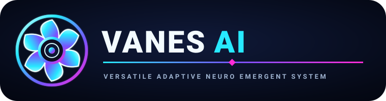

# VANES AI


**VANES AI — Versatile Adaptive Neuro Emergent System** is an online, learner-friendly AI study companion designed around the Tanzanian secondary-school curriculum.



**Made by OB Technologies Lab**


## ▶️ Watch how VANES works



A 28-second animated tour of the four things a learner actually does:

| Step | What happens |
| --- | --- |
| **1 · Ask** | Type in the AI study coach. One question per line — or a numbered list — and VANES reads them as separate requests. English or Kiswahili, up to 6 questions per message. |
| **2 · Get each answer** | Questions are answered one at a time in order, with a live answer queue. Each turn keeps the previous questions as context, so “now in Kiswahili” still refers to the right topic. **Clear** wipes the conversation (press it twice to confirm). |
| **3 · Plan and track** | Generate a study plan, save it to the Study Shelf or start it. The session timer runs, and completing it writes the minutes to the dashboard. |
| **4 · Any device** | The same app reshapes itself: sidebar → menu drawer, and the coach chat moves above the guide on narrow screens. |

> This is an animated SVG illustration, not a screen recording — it lives in the repository as `assets/vanes-demo.svg`, so it needs no video hosting and plays on GitHub. To record a real clip instead, open the production URL below and capture the same four steps; nothing in the app has to change.

## ⬇️ Get VANES

**[🚀 Open VANES AI now →](https://vanes-ai.obtechnologies625.workers.dev/)** &nbsp;·&nbsp; **[📦 Download the app (ZIP)](https://github.com/obtechnologies625-lab/VANES-AI/archive/refs/heads/main.zip)** &nbsp;·&nbsp; **[🧰 View the source](https://github.com/obtechnologies625-lab/VANES-AI)**

- **Just use it** — open the link on a phone, tablet or PC. Nothing to install, no Command Prompt, Python, Node.js or local server.
- **Install it as an app** — browser menu → *Add to Home screen* / *Install app*, or the **⬇ Install VANES AI** button at the bottom of the sidebar (it hides itself once installed). The shell, saved plans and Study Shelf then open with no connection; an offline banner explains that AI answers still need the internet.
- **Download the ZIP** — the whole app is plain static files. Unzip anywhere and open `index.html`, or serve the folder (see [Run it locally](#-run-it-locally)). AI features call the production Worker, so they work from any copy as long as the device is online.

## 🚀 Use VANES online

The production app is deployed as a **Cloudflare Worker**:

**https://vanes-ai.obtechnologies625.workers.dev**

Students can open the app directly from a phone, tablet, or PC. No Command Prompt, Python, Node.js, or local server is required for normal use.

## 🎓 Personal learner profile

VANES asks for the learner profile when the app opens with a new or incomplete profile:

- Full name
- **O-Level / CSEE or Advanced / A-Level**
- O-Level: **all subjects the learner takes** can be selected
- A-Level: the learner chooses an Advanced combination
- A-Level common subjects: **Historia ya Tanzania** and **Academic Communication**
- Profile context is sent to the AI so answers respond to the learner's **level, combination and subjects**, not just their name
- Profile picture can be the VANES default, a picture from the device, or an AI-generated non-identifying avatar

Supported common Advanced combinations include **PCM, PCB, PGM, CBG, CBA, CBN, EGM, ECA, HGE, HGL, HKL, HKA, HEC and HGLi**, with an `OTHER` option for a school-specific combination.

## 🔑 Opening VANES: splash, account and free trial

1. **Splash.** The VANES turbine wheel fades in, then a *MADE WITH — OB Tech-Labs — OB TECH ORG* panel fades in over it, then both fade away.
2. **Account gate.** Sign in with **Firebase Authentication** — email + password, or the **Continue with Google** button — using full name, phone number, email and password. The app stays hidden behind the gate until the learner is signed in. If Firebase cannot be reached at all, the gate offers a *device-only* account so the PWA still opens offline.
3. **Cloud sync.** A signed-in learner's profile, conversations, saved plans, Study Shelf and session history are mirrored to the Firestore document `learners/{uid}`, and restored on any other device (newest `syncedAt` wins). Settings shows whether sync is on, and why not when it is off.
4. **Free trial.** Every learner gets **15 AI answers**, and the allowance **resets 24 hours after the window started**, counted across chat turns, question sets and marking. For Firebase accounts the count lives in the Worker's D1 table `vanes_quota` and is checked against a verified Firebase ID token, so clearing browser storage does not create new free answers. When the trial is used the next AI call is answered with a support panel: a **3,500 TZS Airtel Money donation** — VANES pushes the USSD approval prompt to the learner's phone, and once Airtel confirms the payment the **OB Tech-Labs code counter issues a `VANES-PRO-XXXXX` upgrade code automatically** and shows it on screen — or an upgrade code typed in by hand. Counter codes are single-use: the first learner who redeems one owns it. Master codes listed in the `VANES_PREMIUM_CODES` secret always work.
5. **Account card.** Settings shows who is signed in, the phone number on file, how many free answers are left, the cloud-sync state, and **Sync now**, **Sign out** and **Get Premium**.

Firebase needs four console steps before all of this is live — creating the Firestore database, publishing `firestore.rules`, enabling the Email/Password and Google providers, and authorising the deploy domains. The click-path is in [FIREBASE_SETUP.md](FIREBASE_SETUP.md).

## ★ VANES Premium

Donating **3,500 TZS** with Airtel Money — or redeeming a `VANES-PRO-` upgrade code — unlocks the Premium tools for that signed-in learner. Premium lives server-side in `vanes_quota`, so it follows the account across devices and cannot be unlocked by editing `localStorage`. The workspace opens from the **★ Premium** item in the sidebar:

| Tool | What it does |
| --- | --- |
| **Study-link shortener** | Paste a study link — a video lesson, a past paper — and VANES returns a short `…/s/CODE` link. It is a **302 redirect**: the destination is passed through byte-for-byte, so the source serves the video at its original quality. Click counts are kept per link. |
| **Student portal** | Learners post subject questions and answer each other's on a shared board, filtered by subject. Posting and replying are rate-limited to 30 per hour. |
| **Study tracker** | Per-subject progress built from real activity — AI questions asked, questions attempted, correct answers and study seconds — drawn as a **per-day histogram** for the chosen subject over 7–30 days. The tracker observes the learner's actual AI interactions, so there is nothing extra to fill in. |
| **Parent access** | The learner generates an 8-character code; a parent opens `/parent` on any phone, enters the code and sees the same per-subject histogram — no account, app install or login needed. |
| **Profile picture** | Change the profile picture from inside the Premium workspace: upload a photo from the device (resized on the device first) or pick one of the eight built-in VANES avatars. |

Every Premium endpoint is checked server-side — a verified Firebase ID token plus the premium flag — before any links, posts, progress or codes are read or written.

## 🧠 AI Study Coach

- Chat, practise, analyse, mark, summarise and plan in a full-height coach workspace
- **Ask several questions at once.** Put each question on its own line — or write `1.` `2.` `3.`, or separate them with `?` — and VANES splits them and answers each one in its own turn, in order, with an on-screen queue showing which question it is on. Up to 6 per message; anything beyond that is reported rather than silently dropped. Each turn carries the previous questions as context, so a short follow-up line like *“in Kiswahili”* is attached to the question before it instead of being treated as a question of its own. **Enter** sends, **Shift+Enter** makes a new line, and the input box grows as you type.
- **Clear** empties the current conversation. It needs two presses (the button arms for 3.5 seconds) so a mis-tap cannot delete a revision session.
- **Multiple saved conversations.** Start a new chat or reopen an earlier one from the **☰ History** list; up to 30 conversations are kept on the device, each titled from its first question, and the last 12 messages of the open conversation are sent as context
- **Upload study images for analysis.** Messages containing an image are routed to Mistral's vision model (`pixtral-12b-2409` by default); plain text stays on the chat model. In a multi-question message the image is attached to the first question only
- Generate educational images (returned as self-contained, safety-checked SVG) when the image service is available — start a message with **✧**
- Continue working from subject topic maps

## 📱 Adapts to the device in use

One code base, four shapes. Nothing is served differently per device — the layout reflows:

| Screen | What changes |
| --- | --- |
| **Phone (≤430px)** | Sidebar becomes a slide-in drawer behind a tap-to-close backdrop, opened by the **☰** button in the phone header. The coach chat moves **above** the guide so the conversation is the first thing on screen, and the input row compacts so the text box stays usable. |
| **Large phone / small tablet (431–760px)** | Same drawer layout; the coach header wraps onto its own row with three equal buttons. |
| **Tablet (761–1024px)** | The sidebar returns as a permanent column, the phone header hides, and the coach goes back to two columns. |
| **Desktop (≥1024px)** | Full sidebar, full-height coach workspace with the guide beside the chat. |

Tested with no horizontal scrolling at 320, 360, 390, 414, 650, 768, 900, 1024, 1280 and 1440px. Back/forward navigation follows the current view through the URL hash, so a bookmarked or shared `#coach` link opens straight on the coach.

## 📚 Study plans, Study Shelf and tracked sessions

- Create a focused study plan from the planner
- **Save a plan** to the Study Shelf, or **Start** it to open the workspace with real topic chips for that subject
- Starting a plan creates or reuses a shelf entry and begins timing the session; completing it records the seconds studied against that subject and updates the shelf status (`Ready` → `In progress` → `Completed`)
- Keep up to 50 saved plans/sessions on the device and reopen them later with **Study again**

## 📤 Print and export

Every generated plan can be **printed** or **downloaded as Markdown**, and the whole Study Shelf can be printed or downloaded too. The printed sheet reproduces the same steps the learner sees on screen, with a clean black-on-white print stylesheet and `@page` margins so it is usable on paper in a classroom.

## 📊 Dashboard statistics

The dashboard numbers are calculated from study activity recorded on the device:

| Statistic | Meaning |
| --- | --- |
| Study time this week | Minutes studied since Monday, including the session currently running |
| Current streak | Consecutive days with recorded study, counted in **local time** (Tanzania is UTC+3, so an evening session counts for the right day) |
| Curriculum progress | Percentage of subjects at the learner's level that have been studied at least once |

Before any session is recorded these show `—` rather than a fake zero.

## 🧪 Tanzanian examination paper structure

VANES study cards show the paper structure used by its curriculum mapping:

- **Physics, Chemistry and Biology:** Paper 1, Paper 2 and Paper 3
- **Most two-paper Advanced subjects:** Paper 1 and Paper 2
- **Historia ya Tanzania:** Paper 1 only
- **Academic Communication:** Paper 1 only

## 🧭 Curriculum coverage

### O-Level / CSEE

Kiswahili, English Language, Basic Mathematics, Basic Applied Mathematics, History, Geography, Chemistry, Physics, Biology, Civics, Information and Computer Studies, Commerce, Bookkeeping, Agriculture, Food and Nutrition, Fine Art, Music, French, Arabic, Bible Knowledge, Islamic Knowledge, Physical Education, Economics, Business Studies and Computer Applications.

### Advanced / A-Level

Advanced Mathematics, Economics, History, Geography, Physics, Chemistry, Biology, Historia ya Tanzania, Academic Communication, Kiswahili, Computer Science, Accountancy, Commerce, Business Studies and Computer Applications, with combination-aware personalisation.

## 🎨 Cyberpunk identity

VANES AI uses a **six-turbine wheel** visual identity with a cyberpunk neon treatment, drawn bold enough to stay legible at the 32px navigation size; `assets/vanes-logo-lockup.svg` pairs the wheel with the wordmark and the full name for places with room, like this README. OB Technologies Lab's identity is the brand poster above: a **segmented hexagon mark** (cyan left, magenta right) with the *INNOVATE • BUILD • IMPACT* lockup (`assets/ob-technologies-lab.svg`) and a **plexus brain crossed by two orbital rings** (`assets/ob-tech-labs-brain.svg`). The same identity is used across the app dashboard, navigation branding, the installable icons (`assets/icon-192.png`, `icon-512.png`, `icon-maskable-512.png`) and this README showcase.

## 🔐 AI security and configuration

The frontend talks to the server-side API proxy only; no provider key ever ships to the browser. The secret name depends on the deploy target: the Cloudflare Worker (`src/index.js`) and the Vercel function (`api/chat.js`) use `MISTRAL_API_KEY`, while the Cloudflare Pages function (`functions/api/chat.js`) uses `OPENROUTER_API_KEY`. Never commit a real API key to browser JavaScript, README files, screenshots, or GitHub.

Worker variables and secrets (`src/index.js`):

| Name | Required | Purpose / default |
| --- | --- | --- |
| `MISTRAL_API_KEY` | Yes | Powers `/api/chat` and `/api/image`. Without it both return a clear "not configured" error. |
| `MISTRAL_MODEL` | No | Text chat model. Default `codestral-latest`. |
| `VANES_VISION_MODEL` | No | Model used when a message contains an image. Default `pixtral-12b-2409`. |
| `MISTRAL_IMAGE_MODEL` | No | SVG image-generation model. Defaults to `MISTRAL_MODEL`. |
| `WEB3FORMS_ACCESS_KEY` | No | Contact-form delivery via Web3Forms. A FormSubmit fallback is always available. |
| `RESEND_API_KEY`, `CONTACT_FROM_EMAIL` | No | Alternative contact delivery via Resend. |
| `TWILIO_ACCOUNT_SID`, `TWILIO_AUTH_TOKEN`, `TWILIO_FROM_NUMBER`, `OWNER_PHONE_NUMBER`, `OWNER_AIRTEL_NUMBER` | No | SMS notification of contact/donation requests. |
| `AIRTEL_CLIENT_ID`, `AIRTEL_CLIENT_SECRET` | No | Airtel Money merchant credentials for the 3,500 TZS donation. **Worker secrets only — never put these in browser code.** Without them the donation panel falls back to the manual Airtel number with code entry. |
| `VANES_AIRTEL_NUMBER` | No | Airtel Money number shown for manual donations. Default `+255688346613`. |
| `VANES_DONATION_TZS` | No | Donation amount in TZS. Default `3500`. |
| `DB` | No | D1 database binding for analytics, the `vanes_quota` trial counter, Airtel Money payments, the code counter, short links, the portal, progress and parent codes — see [DATABASE_SETUP.md](DATABASE_SETUP.md). |
| `ADMIN_ANALYTICS_TOKEN` | No | Bearer token protecting `/api/admin/analytics`. |
| `FIREBASE_PROJECT_ID` | No | Firebase project whose ID tokens `/api/chat` accepts. Default `vanes-ai`. |
| `VANES_FREE_LIMIT` | No | Free AI answers per window. Default `15`. |
| `VANES_TRIAL_HOURS` | No | Length of the free-trial window in hours. Default `24`. `VANES_TRIAL_DAYS` still works as a longer override. |
| `VANES_PREMIUM_CODES` | No | Comma-separated master upgrade codes that unlock Premium server-side. Counter-issued codes (`VANES-PRO-…`) work without being listed here. |

Firebase itself is configured in the Firebase console, not here — see [FIREBASE_SETUP.md](FIREBASE_SETUP.md).

`GET /api/health` reports which of these are actually configured — check it after any deploy rather than trusting a green CI badge.

## 🔒 Privacy

Learner profiles, saved plans, the Study Shelf, chat conversations and study activity are stored in the browser's `localStorage` on the learner's own device. When the learner signs in with a Firebase account, a copy of that same data is synced to their own Firestore document `learners/{uid}`; `firestore.rules` allows reads and writes of that document **only** by the signed-in learner who owns it, and denies everything else in the database. Passwords never reach the VANES Worker — Firebase Authentication handles them. Premium data lives in the Worker's D1 database: Airtel Money payment records (reference, phone number, amount, status and the issued code), code counter records, short study links, student-portal posts and replies, per-day subject progress, and parent access codes. A parent code opens a **read-only** view of that learner's per-subject histogram — it cannot post, chat or change anything — since the page only ever returns the histogram and the learner's display name. Theme, notification settings, the profile picture and the anonymous analytics identifier deliberately stay device-local and are not synced. Analytics events use an anonymous browser identifier; question and answer text is only included if the learner explicitly enables the anonymised-learning-data option in Settings. Names, phone numbers and payment credentials are not part of the analytics payload.

## 📈 Analytics and the admin dashboard

Clients POST anonymous events (profile saved, plan started, session completed, rating) to `/api/analytics`. Storage needs a **D1 database** bound as `DB`; `vanes-ai-db` has been bound that way since 2026-10-02, so events are stored (`{"ok":true,"stored":true}`) and `/api/health` reports `analyticsEnabled:true`. If the binding is ever removed the endpoint answers `503` with a readable JSON reason and the event is discarded — the app is unaffected. The `vanes_users` and `vanes_events` tables are created on the first request.

Reading the data back goes through `/api/admin/analytics`, which requires `Authorization: Bearer <ADMIN_ANALYTICS_TOKEN>`. The dashboard that renders it is produced by the Worker, not shipped as a file, and is only served when the token is presented in the URL:

```
https://vanes-ai.obtechnologies625.workers.dev/admin-analytics.html?key=YOUR_TOKEN
```

A wrong or missing `key` returns a plain `404`, so the dashboard is not discoverable by crawling. Full setup steps — creating the database, where the binding must live, and the two ways it silently fails — are in [DATABASE_SETUP.md](DATABASE_SETUP.md).

## 💻 Run it locally

The app is plain static files — serve the repository root with any static server:

```bash
python -m http.server 8123
# then open http://localhost:8123
```

There is no build step and no `package.json`. Client scripts call the production Worker for AI features, so chat and image analysis work locally as long as you have internet; only `/api/analytics` (which clients call on the same origin) will 404 against a plain static server.

When you change a cached file, bump its `?v=` cache-buster in `index.html`, and bump `const CACHE` in `sw.js` — otherwise an already-installed client keeps serving the old copy.

### Project layout

| Path | Role |
| --- | --- |
| `index.html`, `styles.css`, `vanes-*.css` | App shell and styling |
| `vanes-runtime.js`, `vanes-study-system.js`, `full-chat.js` | Core app: views, planner/shelf/sessions, AI coach and conversations |
| `vanes-access.js` | Brand splash, Firebase/device sign-in gate with phone + email + Google, the 24-hour free-trial meter (15 answers, resets 24 hours after the window starts) and the donate/upgrade overlay |
| `vanes-firebase.js` | Firebase Auth + Firestore bridge (ES module) exposing `window.VANES_FB` |
| `vanes-sync.js` | Two-way `localStorage` ↔ Firestore sync for the signed-in learner's data |
| `firestore.rules` | Access policy to paste into Firebase → Firestore → Rules |
| `vanes-profile.js`, `vanes-product-upgrade.js`, `vanes-settings.js`, `vanes-donate.js`, `vanes-notifications.js`, `vanes-mobile.js` | Feature modules |
| `vanes-premium.js` | Premium workspace: study-link shortener, student portal, per-subject histogram tracker, parent codes and profile picture |
| `vanes-brand.js`, `vanes-send-fix.js`, `vanes-ai-context-fix.js`, `vanes-profile-enforcer.js` | Patch layers loaded after the modules above |
| `vanes-pwa.js`, `sw.js`, `manifest.webmanifest`, `assets/icon-*.png` | Install prompt, offline banner, service worker and icons |
| `assets/vanes-demo.svg` | The animated walkthrough shown at the top of this README |
| `src/` | Cloudflare Worker: `index.js` (routes), `contact.js`, `analytics.js`, `firebase-auth.js` (ID-token verification), `quota.js` (server-side trial counter), `codes.js` (OB Tech-Labs premium-code counter), `airtel.js` (Airtel Money collection + payment confirmation), `premium.js` (gated links/portal/progress/parent APIs), `parent-page.js` (the public parent histogram page), `admin-page.js` (the token-gated admin dashboard) |
| `functions/api/chat.js`, `api/chat.js` | Cloudflare Pages and Vercel fallbacks |
| `wrangler.toml`, `.assetsignore`, `vercel.json` | Deploy configuration |
| `docs/`, `google-apps-script/`, `schema.sql`, `DATABASE_SETUP.md`, `FIREBASE_SETUP.md` | Supporting material, database and Firebase setup |

> **Patch layers matter.** `vanes-send-fix.js` listens for `submit` in the capture phase and calls `stopImmediatePropagation()`, so a `submit` handler bound to `#planForm` anywhere else never fires. New planner behaviour belongs inside that file, or behind a `window.VANES_*` hook it calls (the pattern used by `VANES_EXPORT`, `VANES_SAVE_PLAN_SESSION` and `VANES_START_PLAN_SESSION`).

## 🚢 Deployment

Pushing to `main` runs three workflows:

| Workflow | What it does |
| --- | --- |
| **Deploy VANES AI to Cloudflare Workers** | Production. `wrangler deploy` of `src/index.js` with the repo root as static assets. Needs the `CLOUDFLARE_API_TOKEN` and `CLOUDFLARE_ACCOUNT_ID` repository secrets; without them the deploy step is **skipped but the run still reports success**, so always confirm the `Deploy Worker` step conclusion. |
| **Deploy VANES AI** | Publishes the repository to GitHub Pages. Pages has no Worker, so `/api/*` routes do not exist there — it is a mirror, not the production target. It uploads the **entire** repository and ignores `.assetsignore`, so it currently serves `src/index.js`, `wrangler.toml` and `schema.sql` publicly. Pages is deliberately kept on as a second mirror; the Worker domain in this README is the address to share. |
| **Node.js CI** | `node --check` on every JavaScript file under Node 20, 22 and 24. There is no test suite. |

Because static assets are the repository root, `.assetsignore` decides what the *Worker* does not publish. Anything that must stay off the Worker — `src/`, `.github/`, `schema.sql`, `wrangler.toml` — belongs there. Wrangler 4 has no `exclude` key under `[assets]`; adding one is silently ignored and would publish those files (and can also break the 25 MiB asset limit). Note that `.assetsignore` has **no effect on the GitHub Pages deploy**, which uploads everything.

Verify a deploy:

```bash
curl -s https://vanes-ai.obtechnologies625.workers.dev/api/health
curl -s https://vanes-ai.obtechnologies625.workers.dev/sw.js | grep "const CACHE"
```

## 🧰 Known issues

- **The admin dashboard is still locked.** Analytics events are stored (`vanes-ai-db` is bound as `DB`), but the `ADMIN_ANALYTICS_TOKEN` Worker secret has not been created, so `/api/admin/analytics` answers `401 ADMIN_ANALYTICS_TOKEN is not configured on this Worker.` and `/api/health` reports `adminAnalyticsConfigured:false`. Add the secret in Cloudflare → **Workers & Pages → vanes-ai → Settings → Variables and Secrets**, then open `/admin-analytics.html?key=YOUR_TOKEN`: [DATABASE_SETUP.md](DATABASE_SETUP.md).
- **GitHub Pages publishes the Worker source.** `.assetsignore` does not apply to the Pages artifact, so `src/index.js`, `wrangler.toml` and `schema.sql` are publicly readable at `https://obtechnologies625-lab.github.io/VANES-AI/`. No secrets are exposed (API keys are Worker secrets). Pages stays enabled as a mirror by the owner's decision; the Worker URL is the production address.
- **Firebase needs four console clicks to go live.** The code for real accounts, cloud sync and the server-side trial counter is in place, but the Firebase project still needs the Firestore database created, `firestore.rules` published, the Email/Password and Google providers enabled, and the deploy domains authorised. Until then VANES signs learners in against Firebase Auth where it can, syncs nothing, and falls back to a device-only account with an on-device counter. Step-by-step: [FIREBASE_SETUP.md](FIREBASE_SETUP.md).
- **Airtel Money gateway is deployed but dormant until merchant credentials are set.** The donation panel, OB Tech-Labs code counter and Premium tools work now, but the USSD push needs an Airtel merchant account: add `AIRTEL_CLIENT_ID` and `AIRTEL_CLIENT_SECRET` as **secrets** in Cloudflare → **Workers & Pages → vanes-ai → Settings → Variables and Secrets**. Until then a donation falls back to the manual Airtel number with code entry, and Premium can still be unlocked by hand with a `VANES_PREMIUM_CODES` master code.
- **GitHub Pages mirror cannot sync.** Firebase Auth requires the serving domain to be authorised, and the Pages mirror is only worth adding under Authorized domains if you intend to use it — otherwise learners there get device-only accounts.
- **No test suite.** `node --check` catches syntax errors only; the Worker's runtime behaviour is unverified by CI.

## 👨‍💻 Made by OB Technologies Lab

VANES AI is a project by **OB Technologies Lab** — building adaptive educational technology for Tanzanian learners.
